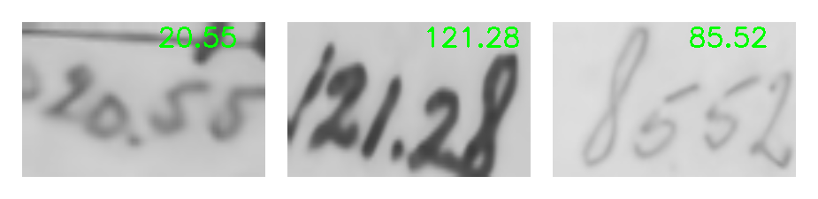

# Handwritten Text Recognition

An end-to-end system which is able to detect handwritten text in images. The Neural Network consists of CNN and RNN layers, combined
with a CTC loss function. This repository is intended to interpret measurements on field sketches. Measurement interpretation using trained model:

Training can be started from train/train.ipynb (For example on Google Colab).
